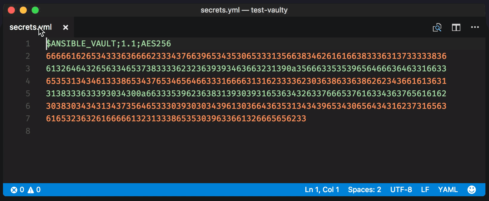

# Vaulty

[](https://marketplace.visualstudio.com/items?itemName=codeflows.vaulty)
[](https://marketplace.visualstudio.com/items?itemName=codeflows.vaulty)
[](https://marketplace.visualstudio.com/items?itemName=codeflows.vaulty)

A safe, zero-configuration plugin for viewing [Ansible Vault](https://docs.ansible.com/ansible/playbooks_vault.html) files in [Visual Studio Code](https://code.visualstudio.com/).



## Prerequisites

Install [Ansible](https://www.ansible.com/) and ensure `ansible-vault` is in PATH.

## Usage

1. Place `ansible.cfg` file in the same directory as the encrypted Vault file, or in any of its parent directories in the workspace.
1. Alternatively, you can place `.ansible.cfg` in your home directory.
1. Add `vault_password_file=<your_password_file>` to the configuration file
1. Run the plugin on the encrypted Vault file to decrypt it (`Vaulty: decrypt and view Ansible Vault file` in the command palette)

For example, if your encrypted Vault file is located at `YOUR_PROJECT/src/secrets.yml`,
here's the order in which Vaulty will try to find a suitable configuration file,
stopping at the first file that contains a `vault_password_file=...` definition:

```
YOUR_PROJECT/src/ansible.cfg
YOUR_PROJECT/ansible.cfg
$HOME/.ansible.cfg
```

For more examples, see the [test vaults](https://github.com/codeflows/vaulty/tree/master/test-vaults).

## Security

The plugin never prompts for a Vault password. It always uses the `vault_password_file=...` statement from a suitable Ansible configuration file. The contents of the `vault_password_file` are not read into memory, instead the file name is passed to the `ansible-vault` command as a parameter. The contents of the Vault are decrypted into a temporary VS Code virtual document that can't be saved nor modified.

## Known issues

Decryption does not work on Ansible 2.4.0 - please upgrade to a newer version (e.g. 2.4.2) if you're having issues.

## Future ideas

Vaults can currently only be viewed, but not edited. PRs welcome!

## Alternative plugins / prior work

[vscode-ansible-vault](https://github.com/dhoeric/vscode-ansible-vault): also allows editing Vaults, but replaces the encrypted file with the decrypted content instead of opening a new buffer.
